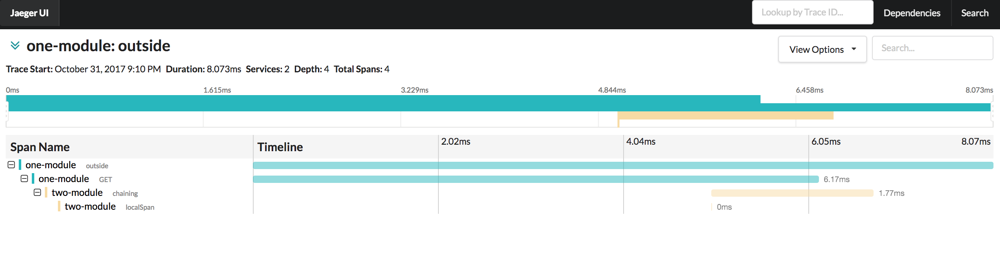

## How to up
1. run docker img  
`docker run -d -p5775:5775/udp -p6831:6831/udp -p6832:6832/udp   -p5778:5778 -p16686:16686 -p14268:14268 jaegertracing/all-in-one:latest`  
2. up application in module 1
3. up application in module 2
4. in terminal   
`curl -get http://localhost:8081/outside` 
5. check [localhost:16686](http://localhost:16686)

## Screenshot
